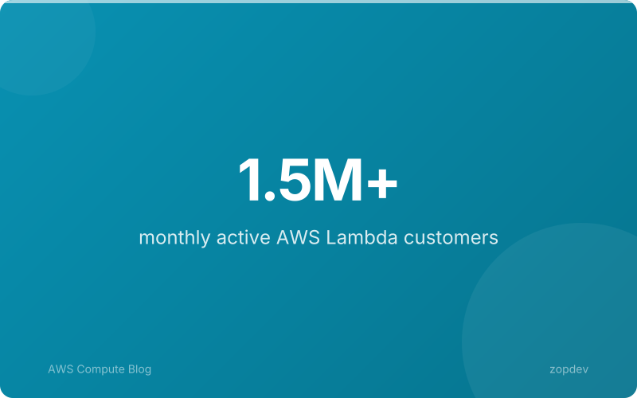
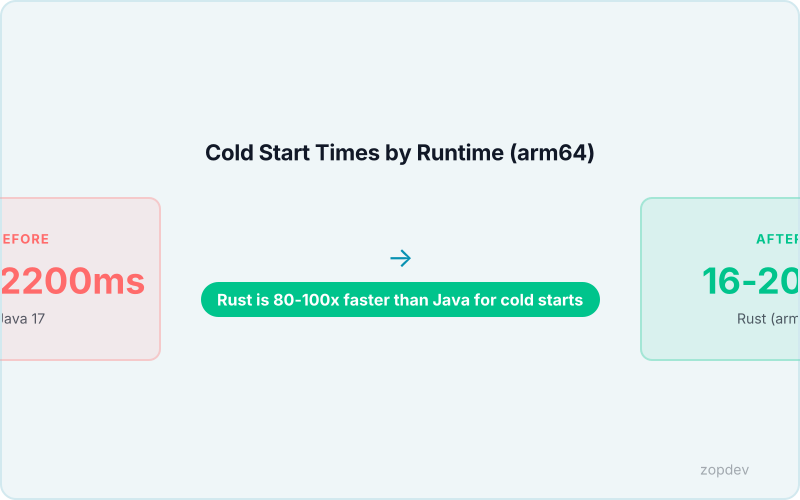
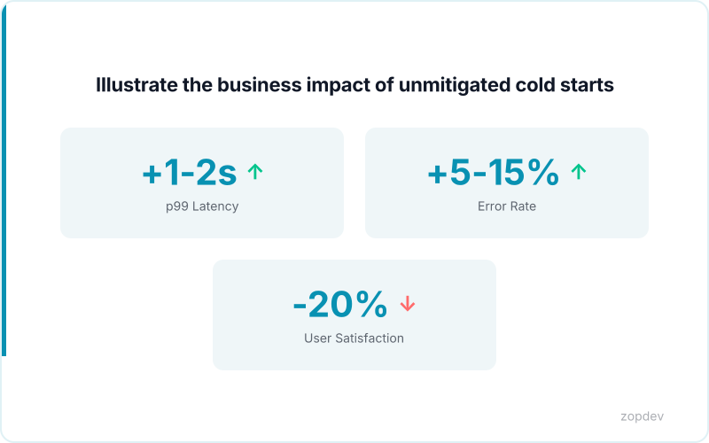

<!-- Generated by transform-chapter.ts with openai/MiniMax-M2 -->
<!-- Density: light | Word target: 800-1200 -->

AWS Lambda serves over 1.5 million customers and processes tens of trillions of invocations annually. For SREs, this scale means cold starts are not a theoretical concern—they directly threaten SLA compliance. Cold starts occur during the INIT phase, adding 16ms to 2s+ of latency depending on runtime (AWS Lambda Documentation). Unmitigated cold starts directly impact p99 latency, error rates, and user-facing SLA compliance (AWS Architecture Blog). This chapter demystifies the cold start lifecycle so you can identify when latency spikes threaten your reliability targets and apply targeted optimizations without sacrificing velocity.



## The Cold Start Lifecycle: Init, Invoke, and Shutdown

The Lambda execution model divides into three distinct phases. The **INIT** phase loads the runtime, executes initialization code, and sets up the execution environment. The **INVOKE** phase runs your handler function—this is when your actual code executes. The **SHUTDOWN** phase occurs when AWS terminates the environment after a period of inactivity.

A cold start happens when INIT runs. This phase adds 16ms to 2s+ of latency depending on runtime (AWS Lambda Documentation). A warm invocation skips INIT entirely. Only INVOKE executes, making subsequent calls dramatically faster. Rust Lambda functions on arm64 achieve 16-20ms cold starts versus 1600-2200ms for Java—a 100x difference (AWS Compute Blog).

Most cold start latency originates in the INIT phase. This is where you can optimize. Place initialization code outside your handler function. This code runs once during INIT, not on every invocation.

```python
import boto3

# This runs once during INIT - outside the handler
db_client = boto3.client('dynamodb')
cached_config = load_config()

def handler(event, context):
    # This runs every time
    return process(event, cached_config)
```

By moving expensive setup work outside the handler, you pay the cost once per execution environment rather than on every request. Understanding which phase executes your code is the first step toward reducing cold start impact on your SLAs.

```{.d2 width="100%" file="../diagrams/vpa-workflow.d2"}
```

*Visualize the three phases of Lambda execution lifecycle*

## Runtime Performance: Why Your Language Choice Matters

Your language runtime determines cold start magnitude. This is an architectural decision, not an implementation detail.

Rust Lambda functions on arm64 achieve 16-20ms cold starts versus 1600-2200ms for Java—a 100x difference (AWS Compute Blog). Python falls between these extremes, typically adding hundreds of milliseconds during initialization. These gaps stem from how each runtime starts up. The Java Virtual Machine must bootstrap the entire runtime environment, load class libraries, and execute JIT compilation before your code runs. This JVM startup overhead dominates cold start duration for Java functions. Interpreted languages like Python avoid this compilation phase but still incur runtime initialization costs—the interpreter must load, parse dependencies, and prepare the execution context. Rust compiles to a native arm64 binary, requiring virtually no runtime bootstrapping.

For SREs evaluating cost-effective architectures, AWS Graviton2 processors provide 13-24% faster cold starts and 19% better price/performance (AWS Graviton2). Moving from x86 to arm64 Lambda functions reduces both latency and compute costs simultaneously. This makes runtime selection a reliability decision, not merely a developer preference. When your p99 latency budgets cannot accommodate multi-second cold starts, choosing a compiled language or provisioned concurrency becomes a capacity planning requirement. The benchmark data is clear: language choice directly determines whether cold starts threaten your SLA or remain invisible to end users.



## Why Cold Starts Matter to Your SLAs

For latency-sensitive workloads, cold starts create immediate SLA risk. When an API gateway, real-time application, or user-facing endpoint receives a request after the Lambda environment has been terminated, the INIT phase runs before the handler executes. This adds 16ms to over 2 seconds of latency depending on runtime (AWS Lambda Documentation). For a synchronous API with a 3-second timeout, a 2-second cold start leaves only 1 second for actual processing—any downstream dependency can trigger timeout errors in client applications.

Health checks amplify this problem. Load balancers typically expect responses within 2-3 seconds. A cold start that exceeds this threshold causes failed health checks, triggering unnecessary instance cycling and degraded availability. The result is violated SLOs, increased error rates, and degraded user experience.

Not all architectures face equal risk. Synchronous APIs and interactive user experiences wait for Lambda responses, making every millisecond of cold start latency visible to end users. Async event processing and background jobs tolerate initialization delays because no user waits for a response.

When your SLA commitment promises p99 latency under 500ms, unmitigated cold starts directly impact p99 latency, error rates, and user-facing SLA compliance (AWS Lambda Documentation). This is the problem that optimization patterns solve.



## Key Optimization Strategies for SREs

SREs have four primary patterns to address cold start risk. Provisioned Concurrency eliminates cold starts entirely by maintaining warm execution environments. When enabled, functions initialize before invocation, removing INIT phase latency completely. The trade-off is cost—AWS charges a 16% premium over on-demand pricing when fully utilized. This premium makes sense when SLA penalties exceed the additional compute cost, or when user-visible latency must remain predictable regardless of traffic patterns.

AWS Graviton2 processors provide 13-24% faster cold starts and 19% better price/performance (AWS Graviton2). Migration requires changing the architecture to arm64. Most functions port with zero code changes. The combined latency improvement and cost reduction make this a high-ROI optimization for latency-sensitive workloads.

Execution Context Reuse leverages Lambda's built-in behavior. When the same function instance handles multiple invocations, the execution context persists between calls. Connections, credential caches, and loaded modules remain available. SREs should design handlers to initialize expensive resources once and reuse them across invocations.

Package Size Optimization targets the INIT phase directly. Smaller deployment packages download and extract faster. Removing unused dependencies and compressing assets reduces initialization duration. This pattern costs nothing and applies universally.

Not every workload needs these mitigations. Async event processing and background jobs tolerate cold starts because no user waits for a response. Synchronous APIs and real-time user experiences require active mitigation. Context determines the appropriate strategy.

```{.d2 width="100%" file="../diagrams/platform-maturity-stages.d2"}
```

*Show progression from basic to advanced cold start mitigation*

## Summary: Cold Starts Are a Solvable Problem

Cold starts occur during the INIT phase of Lambda execution, adding 16ms to 2s+ of latency depending on runtime (AWS Lambda Documentation). For SREs managing synchronous APIs and real-time endpoints, this initialization delay directly threatens SLA commitments.

The performance variance across languages is stark. Rust Lambda functions on arm64 achieve 16-20ms cold starts versus 1600-2200ms for Java—a 100x difference (AWS Lambda Documentation). When your p99 SLA sits at 500ms, choosing Java means cold starts consume the entire latency budget before any handler logic runs.

AWS Graviton2 processors provide 13-24% faster cold starts and 19% better price/performance (AWS Graviton2). Migration requires arm64 architecture but involves minimal code changes for most workloads.

Unmitigated cold starts directly impact p99 latency, error rates, and user-facing SLA compliance (AWS Lambda Documentation). This chapter has established the problem space. Subsequent sections will examine provisioned concurrency trade-offs, context reuse patterns, and package optimization techniques—practical tools SREs apply based on their specific latency requirements and cost constraints.
