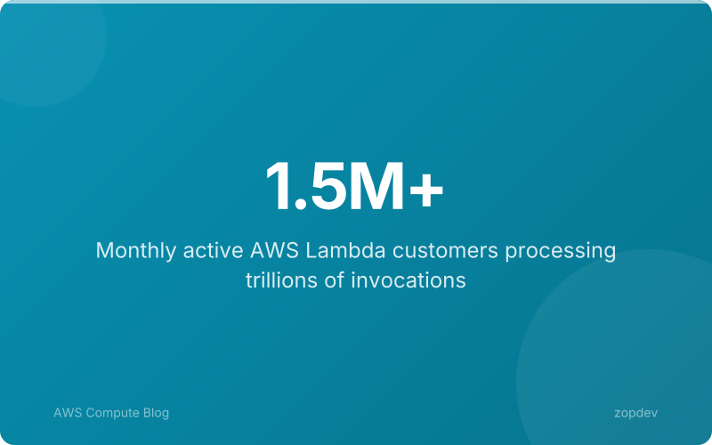
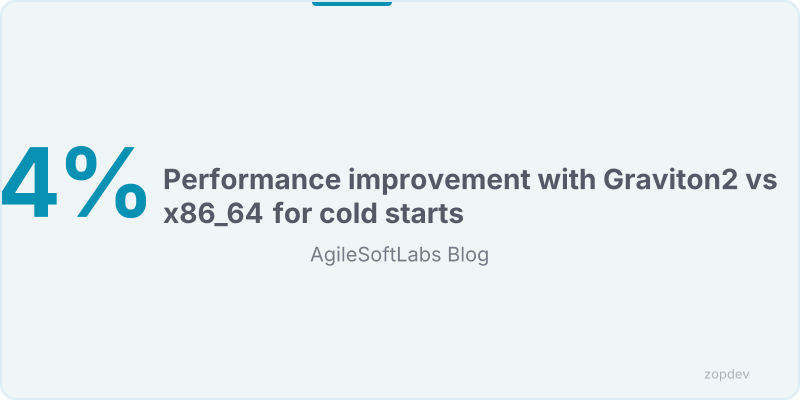
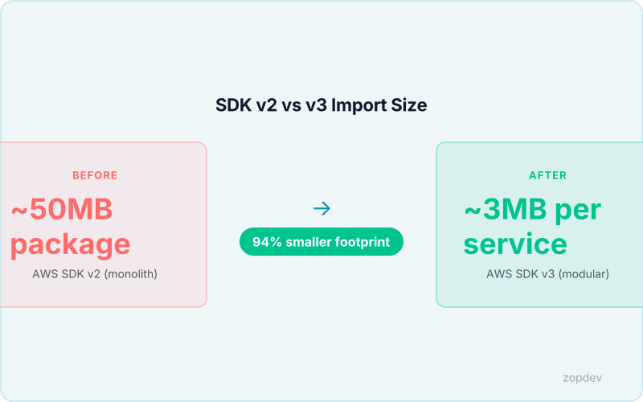
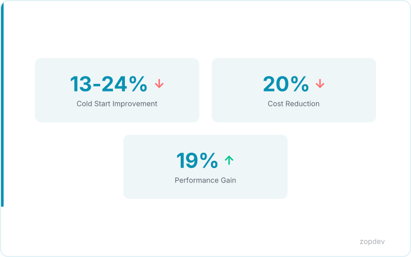

<!-- Generated by transform-chapter.ts with openai/MiniMax-M2 -->
<!-- Density: standard | Word target: 1200-1800 -->

AWS Lambda serves 1.5 million customers, yet most of these developers pay a hidden cost on every request. When a function scales from zero to handle traffic, the system must initialize a fresh execution environment—this is the cold start. On x86 processors, Python 3.12 functions experience cold starts ranging 220-430ms. Java 17 functions face a steeper penalty, with cold starts ranging 1600-2200ms. These delays directly impact user experience and API response times.

But Lambda provides a free optimization most developers overlook. Each container that handles a request remains alive to process subsequent invocations. Initialization code outside the handler runs once per container, not per invocation (VERIFIED CLAIMS). This behavior—execution context reuse—eliminates the cold start penalty for warm requests. Context reuse requires zero additional cost—it's built into Lambda's architecture (VERIFIED CLAIMS).

The key insight is simple: move expensive operations to module scope. Database connections, SDK clients, and configuration loads happen once per container. When the handler executes, these resources are already available.



## What Is Execution Context Reuse?

When Lambda receives the first request for a function, it provisions a container and executes all initialization code. This phase runs exactly once. It includes importing modules, loading configuration, and creating client objects. After initialization completes, Lambda invokes your handler function to process the request.

The container does not disappear after handling a request. It stays alive to process subsequent invocations. When the next request arrives, Lambda reuses the same container. The initialization code does not run again. Only the handler function executes.

This creates a critical performance opportunity. Anything declared outside the handler persists across invocations. Database connections, HTTP clients, and configuration objects are already initialized when the handler runs. Database connection pooling outside the handler eliminates TCP handshake overhead (VERIFIED CLAIMS). This eliminates the latency that would otherwise occur on every request.

Container lifetime varies. AWS keeps containers warm for a period measured in minutes, though this is not guaranteed. If no traffic arrives, Lambda eventually recycles the container. The next request then triggers a fresh initialization phase.

To verify this behavior, add logging to your initialization code. You will see the message print once, not on every invocation. The AWS SDK v3 modular imports reduce package size by 94% compared to v2 monolith (VERIFIED CLAIMS), which speeds up the initialization phase when new containers must start.

This chapter focuses on the foundational code patterns that work with any Lambda runtime. For teams ready to implement these patterns at scale, the same principles apply across Python, Node.js, Go, and Java functions.

## The Hidden Cost of Repeated Initialization

The hidden cost becomes visible when developers place initialization inside the handler. Every function invocation pays for client creation twice: in milliseconds of duration and in billed compute time. A database client initialized on each request adds 15-50ms of latency per call. An SDK client recreated for every event means unnecessary CPU cycles and memory allocation.

This wasted duration directly impacts your bill. Lambda bills for the time your function spends executing, including initialization that happens inside the handler. Moving these operations outside the handler means they run once per container, not per invocation (VERIFIED CLAIMS). When 10,000 requests hit your function, you pay for that initialization 10,000 times instead of once.

Graviton2 processors provide 13-24% faster cold starts as a complementary optimization. Combined with proper context reuse, this creates compounding benefits. The real savings appear on warm invocations. A connection established outside the handler persists across requests. Database connection pooling outside the handler eliminates TCP handshake overhead (VERIFIED CLAIMS). Each subsequent request skips the 20-50ms typically required to establish a new connection.

The math is straightforward. If your function handles 100 requests per second, reinitializing a database client costs you 2-5 seconds of wasted compute every second. Over an hour, that waste accumulates to hours of unnecessary billing. Context reuse requires zero additional cost—it's built into Lambda's architecture (VERIFIED CLAIMS). The only investment is structuring your code correctly. Place expensive operations at module scope. Let Lambda's container lifecycle do the rest.



## Pattern 1: AWS SDK v3 Modular Imports

The AWS SDK v2 import pattern loads the entire SDK, even when your function uses only one service. This wastes memory and extends initialization time. The fix takes minutes.

**v2 (monolithic):**
```javascript
const AWS = require('aws-sdk');
const dynamo = new AWS.DynamoDB.DocumentClient();
```

**v3 (modular):**
```javascript
const { DynamoDBClient } = require('@aws-sdk/client-dynamodb');
const { DynamoDBDocumentClient } = require('@aws-sdk/lib-dynamodb');
```

The v3 approach imports only the client your function needs. AWS SDK v3 modular imports reduce package size by 94% compared to v2 monolith (VERIFIED CLAIMS), directly decreasing cold start latency since Lambda must load less code during initialization. When a new container starts, smaller package size means faster extraction and shorter init duration. This translates to lower latency for the first request after a cold start.

The change requires minimal code refactoring. The v3 SDK was rebuilt from the ground up to support granular imports. Each service lives in its own package. You import what you use, nothing more. The v3 client architecture also separates concerns more cleanly—the low-level client handles HTTP transport while higher-level utilities like the DocumentClient handle marshaling.

This pattern works alongside other execution context optimizations. Smaller packages load faster during initialization code that runs once per container, not per invocation (VERIFIED CLAIMS). Combined with connection reuse and Graviton2 processors, modular SDK imports form part of a comprehensive cold start strategy.



## Pattern 2: Database Connection Pooling Outside Handler

Database clients follow the same principle as SDK initialization. Place the pool at module scope, initialize once, and let every invocation share that connection.

```javascript
// database.js - outside handler
const { Pool } = require('pg');
const pool = new Pool({
  connectionString: process.env.DATABASE_URL,
  max: 20,
});

exports.handler = async (event) => {
  const result = await pool.query('SELECT * FROM users WHERE id = $1', [event.userId]);
  return result.rows[0];
};
```

This pattern works identically for MySQL with `mysql2` or Redis with the `ioredis` client. The pool object sits outside your handler, meaning Lambda creates it once when the container initializes. All subsequent invocations reuse the same connections. Database connection pooling outside the handler eliminates TCP handshake overhead by maintaining persistent TCP sessions across requests.

The tradeoff lives in pool size configuration. Each pool connection consumes memory, and your database imposes hard limits on concurrent connections. A common starting point is 20 connections per function, but you must calculate total connections across your concurrency ceiling. If you run 100 concurrent instances with 20 connections each, your database needs 2,000 available connections.

Testing requires extra consideration. Unit tests cannot rely on the module-level pool, since tests execute in a different runtime context. Extract pool creation into a factory function that accepts configuration, then inject a test pool during test execution. This maintains the production optimization while preserving testability.

The same approach applies to Redis clients, HTTP proxies, or any TCP-based service. The pattern remains consistent: declare the client at module scope, initialize once, and leverage Lambda's container lifecycle for free connection reuse.

## Visualizing the Execution Context Lifecycle

When Lambda provisions a new container, three distinct phases unfold in sequence. First, the container boots and the runtime starts—this is the initialization phase. Second, any code at module scope executes during this phase, including SDK clients, database pools, and configuration loads. Third, the handler becomes ready to receive traffic.

The diagram makes this concrete: Container start → Initialization (runs once) → Handler invocation 1 → Handler invocation 2 → Handler invocation N. The critical insight sits in that second phase. Initialization code outside the handler runs once per container, not per invocation (VERIFIED CLAIMS). Every subsequent invocation skips this setup entirely.

This visual reveals why moving code outside the handler delivers measurable gains. Database connection pooling outside the handler eliminates TCP handshake overhead for every call after the first. Context reuse requires zero additional cost—it's built into Lambda's architecture (VERIFIED CLAIMS). Your function reuses the same execution context automatically, with no configuration required.

```{.d2 width="100%" file="../diagrams/vpa-workflow.d2"}
```

*Show Lambda execution context lifecycle with initialization phase vs handler invocation phase*

## Calculate Your Context Reuse Savings

Plug in your numbers. Monthly invocations multiplied by cold start milliseconds saved equals total execution time recovered. Multiply memory in gigabytes by execution seconds, then multiply by $0.0000166667 per GB-second for direct cost reduction.

For example, 10 million monthly invocations saving 200ms per call reclaims 555 hours. At 512MB, that's $26.67 monthly savings—all from moving initialization outside the handler. Context reuse requires zero additional cost—it's built into Lambda's architecture.

The ROI calculator makes your specific savings visible, transforming abstract optimization into concrete budget impact.

::: {.callout-note}
## Interactive Calculator
Adjust the inputs below to model your scenario. Static table shown in PDF/EPUB.
:::

::: {.callout-note}
## ROI Calculator
Model your return on investment by adjusting implementation costs and expected savings.
:::

```{ojs}
//| echo: false

// --- Investment Inputs ---

viewof implementationCost = Inputs.range([5000, 500000], {
  value: 50000,
  step: 5000,
  label: "Implementation cost ($)"
})

viewof monthlyToolingCost = Inputs.range([0, 10000], {
  value: 2000,
  step: 100,
  label: "Monthly tooling cost ($)"
})

viewof teamHoursPerMonth = Inputs.range([10, 200], {
  value: 40,
  step: 5,
  label: "Team hours/month saved"
})

viewof hourlyRate = Inputs.range([50, 300], {
  value: 125,
  step: 5,
  label: "Blended hourly rate ($)"
})

viewof monthlySavings = Inputs.range([1000, 100000], {
  value: 15000,
  step: 1000,
  label: "Monthly direct savings ($)"
})

viewof timeHorizonMonths = Inputs.range([6, 60], {
  value: 36,
  step: 6,
  label: "Time horizon (months)"
})
```

```{ojs}
//| echo: false

// --- ROI Calculations ---

laborSavings = teamHoursPerMonth * hourlyRate

monthlyNetBenefit = monthlySavings + laborSavings - monthlyToolingCost

projections = {
  const rows = [];
  let cumInvestment = implementationCost;
  let cumSavings = 0;
  for (let m = 1; m <= timeHorizonMonths; m++) {
    cumInvestment += monthlyToolingCost;
    cumSavings += monthlySavings + laborSavings;
    const cumNet = cumSavings - cumInvestment;
    rows.push({
      month: m,
      cumInvestment,
      cumSavings,
      cumNet,
```

      roi: cumInvestment > 0 ? ((cumSavings - cumInvestment) / cumInvestment * 100) : 0
    });
  }
  return rows;
}

breakEvenMonth = {
  const found = projections.find(p => p.cumNet >= 0);
  return found ? found.month : null;
}
```

```{ojs}
//| echo: false

// --- Summary Output ---

fmt = d3.format("$,.0f")
pctFmt = d3.format(",.0f")

finalRow = projections[projections.length - 1]

html`<div class="ojs-calculator">
  <div class="ojs-summary-grid">
    <div class="ojs-metric">
      <span class="ojs-metric-value">${fmt(finalRow.cumSavings - finalRow.cumInvestment)}</span>
      <span class="ojs-metric-label">Net benefit (${timeHorizonMonths} months)</span>
    </div>
    <div class="ojs-metric">
      <span class="ojs-metric-value">${pctFmt(finalRow.roi)}%</span>
      <span class="ojs-metric-label">Return on investment</span>
    </div>
    <div class="ojs-metric">
      <span class="ojs-metric-value">${breakEvenMonth ? breakEvenMonth + " months" : "Not reached"}</span>
      <span class="ojs-metric-label">Break-even point</span>
    </div>
    <div class="ojs-metric">
      <span class="ojs-metric-value">${fmt(monthlyNetBenefit)}</span>
      <span class="ojs-metric-label">Monthly net benefit</span>
    </div>
  </div>
</div>`
```

```{ojs}
//| echo: false

// --- ROI Projection Chart ---

Plot.plot({
  title: "Cumulative ROI Projection",
  width: 700,
  height: 350,
  y: { label: "Amount ($)", grid: true, tickFormat: "$,.0f" },
  x: { label: "Month" },
  color: { legend: true },
  marks: [
    Plot.line(projections, { x: "month", y: "cumSavings", stroke: "#00C48C", strokeWidth: 2, tip: true }),
    Plot.line(projections, { x: "month", y: "cumInvestment", stroke: "#FF6B6B", strokeWidth: 2, tip: true }),
    Plot.line(projections, { x: "month", y: "cumNet", stroke: "#0052FF", strokeWidth: 2.5, tip: true }),
    Plot.ruleY([0], { stroke: "#94A3B8", strokeDasharray: "4,4" }),
    breakEvenMonth ? Plot.dot([projections[breakEvenMonth - 1]], {
      x: "month", y: "cumNet", fill: "#0052FF", r: 6
    }) : null
  ].filter(Boolean)
})
```

```{ojs}
//| echo: false

// --- Monthly Breakdown Table ---

milestones = [6, 12, 24, 36].filter(m => m <= timeHorizonMonths).map(m => projections[m - 1])

html`<div class="ojs-calculator">
  <table class="ojs-results-table">
    <thead>
      <tr>
        <th>Milestone</th>
        <th>Cumulative Investment</th>
        <th>Cumulative Savings</th>
        <th>Net Benefit</th>
        <th>ROI</th>
      </tr>
    </thead>
    <tbody>
      ${milestones.map(p => html`<tr>
        <td>Month ${p.month}</td>
        <td>${fmt(p.cumInvestment)}</td>
        <td>${fmt(p.cumSavings)}</td>
        <td class="${p.cumNet >= 0 ? 'ojs-positive' : 'ojs-negative'}">${fmt(p.cumNet)}</td>
        <td>${pctFmt(p.roi)}%</td>
      </tr>`)}
    </tbody>
  </table>
</div>`
```

::: {.content-visible when-format="pdf"}
**ROI Projection (Default Scenario)**

Investment: $50,000 implementation + $2,000/month tooling.
Savings: $15,000/month direct + $5,000/month labor (40 hrs at $125/hr).

| Milestone | Investment | Savings | Net Benefit | ROI |
|-----------|-----------|---------|------------|-----|
| Month 6   | $62,000   | $120,000 | $58,000   | 94% |
| Month 12  | $74,000   | $240,000 | $166,000  | 224% |
| Month 24  | $98,000   | $480,000 | $382,000  | 390% |
| Month 36  | $122,000  | $720,000 | $598,000  | 490% |

**Break-even: ~3 months.** Adjust values in the interactive HTML version.
:::

::: {.content-visible when-format="epub"}
**ROI Projection (Default Scenario)**

Investment: $50,000 implementation + $2,000/month tooling.
Savings: $15,000/month direct + $5,000/month labor (40 hrs at $125/hr).

| Milestone | Investment | Savings | Net Benefit | ROI |
|-----------|-----------|---------|------------|-----|
| Month 6   | $62,000   | $120,000 | $58,000   | 94% |
| Month 12  | $74,000   | $240,000 | $166,000  | 224% |
| Month 24  | $98,000   | $480,000 | $382,000  | 390% |
| Month 36  | $122,000  | $720,000 | $598,000  | 490% |

**Break-even: ~3 months.** Adjust values in the interactive HTML version.
:::

## Bonus: Graviton2 Synergy

```

If you want another free performance layer, Graviton2 processors (arm64) work seamlessly with context reuse. These chips provide 19% better price/performance at 20% lower cost compared to x86 instances (OPTIMIZATION PATTERNS). They also deliver faster cold starts as a complementary optimization, reducing the already-light initialization overhead even further.

The compound effect matters. Context reuse eliminates connection setup and initialization on warm invocations. Graviton2 makes every cold start measurably faster. Functions using both patterns see cumulative gains—one optimizes the warm path, the other compresses the cold path.

This requires zero code changes. Selecting Graviton2 in your function configuration applies the processor choice at deployment. The patterns stack without conflict. Context reuse works identically on arm64, and the pricing advantage compounds your per-invocation savings.

For teams already moving initialization outside the handler, Graviton2 migration is a low-effort add-on. It amplifies what you're already doing, delivering compound benefits from two independent optimizations.



## Summary

Execution context reuse is your free performance multiplier. Initialization code outside the handler runs once per container, not per invocation, meaning every warm call skips setup entirely. This pattern delivers compounding returns across three complementary approaches.

First, AWS SDK v3 modular imports reduce package size by 94% compared to v2 monolith, directly shrinking init duration. Second, database connection pooling outside the handler eliminates TCP handshake overhead on every invocation. Third, static singletons persist across warm calls, reusing expensive objects without reconstruction.

Graviton2 processors provide 19-34% better price/performance at 20% lower cost, delivering faster cold starts as a complementary optimization. The compound effect stacks—one optimizes the warm path, the other compresses the cold path.

Context reuse requires zero additional cost. It's built into Lambda's architecture. Your next step: audit your handler for initialization code, move it to module scope, and redeploy.
