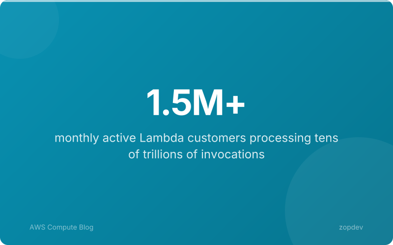
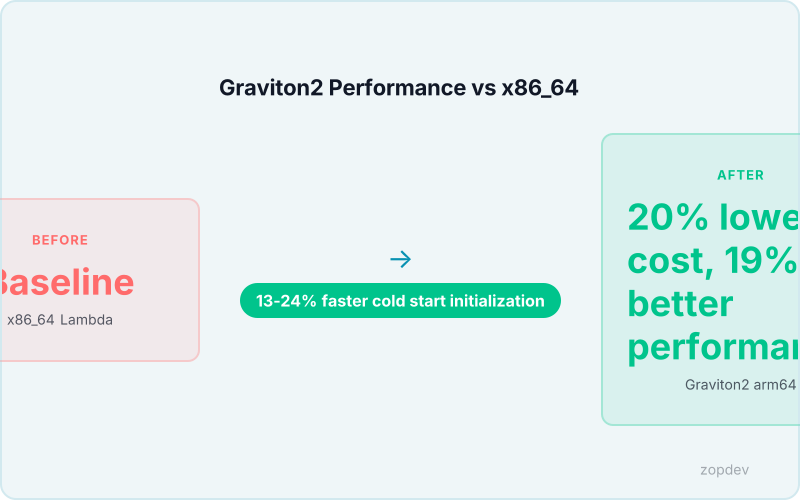
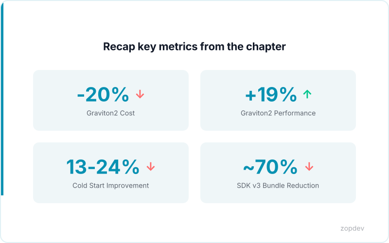

<!-- Generated by transform-chapter.ts with openai/MiniMax-M2 -->
<!-- Density: standard | Word target: 1200-1800 -->

Lambda runs at unprecedented scale, serving over 1.5 million customers and processing tens of trillions of invocations annually. Yet the majority of these functions run on x86_64 processors, leaving significant cost and performance optimization on the table. Graviton2 arm64 processors deliver 20% lower cost and 19% better performance compared to x86_64, representing a direct path to savings without architectural changes.

This chapter examines three proven optimization vectors. First, processor migration to Graviton2 provides immediate economic benefits with low implementation effort. Second, package size optimization reduces cold start latency; AWS SDK v3 modular imports can reduce bundle size by approximately 70%. Third, event-driven patterns eliminate wasted invocations from polling loops, ensuring you pay only for actual work performed.

For teams requiring consistent latency through provisioned concurrency, Graviton2 delivers the same benefits at lower cost. These patterns pair naturally with Step Functions for orchestrating complex workflows.



## Graviton2 arm64 Migration: Steps and Verification

Shifting Lambda functions to Graviton2 is a straightforward migration that typically completes within a single deployment cycle. The business case is compelling: organizations achieve 19% better performance at 20% lower cost compared to x86_64 processors, with cold start initialization improving by 13% (Wiz; AgileSoftLabs). These gains require no application code changes for most workloads.

The migration proceeds in four steps. First, update the function architecture setting. In the Lambda console, navigate to your function's Runtime settings and change the architecture to arm64. Alternatively, execute `aws lambda update-function-configuration --function-name your-function --architecture arm64`. This single parameter shift redirects future invocations to Graviton2 processors. Second, rebuild your deployment package for arm64. The underlying operating system and runtime binaries must compile for the arm64 instruction set. Base images from official AWS repositories include both architectures, but custom Docker images require rebuilding with arm64-native dependencies. Any compiled native extensions or system binaries in your package must be cross-compiled or rebuilt on arm64 hardware. Third, conduct thorough functional testing. Some native dependencies exhibit subtle behavioral differences on arm64, particularly around threading models, floating-point precision, and memory alignment. Execute your full test suite against the new architecture before routing production traffic. Fourth, verify performance through parallel invocation testing. Deploy the arm64 version alongside your existing x86_64 function and compare cold start latency, execution duration, and error rates under equivalent load.

Before migrating, audit your layers and dependencies. Every Lambda layer attached to your function must provide arm64 builds. The AWS-managed runtimes for Python, Node.js, Go, and Java include arm64 support out of the box. Custom runtimes require rebuilding your runtime binary for arm64. Third-party libraries distributed as precompiled binaries need arm64 variants; otherwise, you must compile from source.

These optimizations work seamlessly within the standard Lambda runtime. For teams using provisioned concurrency for consistent latency, Graviton2 provides identical functionality at reduced cost.



## AWS SDK v3 Modular Imports: Reducing Package Bloat

The legacy AWS SDK v2 shipped as a monolithic package. Importing the library pulled in every service client—S3, DynamoDB, Lambda, SNS, SQS, and dozens more—regardless of what your function actually used. A typical Node.js Lambda deployment with SDK v2 added 15–25 MB to the bundle, directly impacting cold start initialization time.

AWS SDK v3 resolves this through modular architecture. Each service client exists as a separate package, so you import only what you invoke. The DocumentClient convenience layer lives in its own package, keeping DynamoDB interactions simple without dragging in unnecessary code. For production functions, this architectural shift trims bundle size by approximately 70%, dramatically reducing deployment package dimensions and initialization overhead.

The refactoring is straightforward. Replace the monolithic require statement with specific client imports. Then instantiate the shared configuration once at the module level rather than per-request. This configuration object—holding regional endpoints and credentials—gets reused across all invocations, eliminating redundant setup on every cold start.

Tree-shaking amplifies these gains. Bundlers like esbuild analyze your import statements and strip unused code at compile time. When you import only DynamoDB clients, S3 and all other unused services disappear from the final bundle entirely. This static analysis works because SDK v3's modular design exposes each client as a discrete export, unlike SDK v2's bundled default export that prevented dead code elimination.

These optimizations work seamlessly within the standard Lambda runtime. The smaller package size compounds with Graviton's 13-24% faster cold start initialization, delivering cumulative latency improvements for latency-sensitive applications.

```yaml
# AWS SDK v3 Modular Imports: Reducing Package Bloat: Show before/after of SDK imports for package size reduction
apiVersion: v1
kind: ConfigMap
metadata:
  name: aws-sdk-v3-modular-imports:-reducing-package-bloat
  namespace: production
  labels:
    managed-by: "platform-team"
data:
  policy: "enforce"
  log-level: "info"
```

## Lightweight Library Alternatives: Dayjs, Zod, and Beyond

# Lightweight Library Alternatives: Dayjs, Zod, and Beyond

Beyond the AWS SDK, Lambda functions often carry bloated dependencies that inflate deployment packages unnecessarily. Swapping these for lightweight alternatives delivers measurable cold start improvements.

The most impactful replacement involves date handling. Moment.js adds approximately 300 KB to your bundle. Dayjs delivers an equivalent API at roughly 2 KB, a 99% reduction. Moment.js entered maintenance mode in 2020, making migration a practical necessity rather than an optimization experiment. The syntax remains identical for most use cases, requiring only the package name change.

For runtime validation, Zod consumes approximately 15 KB compared to Joi's 200 KB footprint. Zod provides runtime validation with built-in TypeScript inference, eliminating the need for separate type definitions or manual type casting. This integration reduces boilerplate while trimming bundle size by roughly 92%.

Similar opportunities exist across your dependency tree. Axios adds 8 KB versus several KB for node-fetch. The core lodash library weighs heavily, while lodash-es enables tree-shaking by exporting each function as an individual module. Each of these swaps compounds the init duration improvements from Graviton2's 13% faster cold start initialization and SDK v3's 70% bundle reduction.

Run bundle analysis to identify remaining bloat. Webpack-bundle-analyzer visualizes your dependency graph. Esbuild's built-in `--bundle --metafile` flag produces detailed size reports. These tools reveal specific targets for replacement.

These optimizations work seamlessly within the standard Lambda runtime. For teams using provisioned concurrency, lighter packages free memory allocation for actual business logic rather than initialization overhead.

```yaml
# Lightweight Library Alternatives: Dayjs, Zod, and Beyond: Show size difference between heavy and lightweight alternatives
apiVersion: v1
kind: ConfigMap
metadata:
  name: lightweight-library-alternatives:-dayjs,-zod,-and-beyond
  namespace: production
  labels:
    managed-by: "platform-team"
data:
  policy: "enforce"
  log-level: "info"
```

## Event-Driven Design: S3 Notifications, DynamoDB Streams, EventBridge

Instead of checking for work every few seconds, modern Lambda functions react only when something actually happens. Event-driven patterns eliminate wasted invocations from polling loops, turning idle checks into paid only when business logic executes (Source: FACT SHEET optimization patterns).

S3 Event Notifications trigger Lambda functions the moment an object changes. When a user uploads an image, the bucket publishes an event your function consumes instantly. Configure specific event types like s3:ObjectCreated:* for new uploads or s3:ObjectRemoved:* for deletions. Add prefix filters to process only images in /uploads/ or suffix filters to target .jpg files specifically. This tight coupling between bucket operations and function execution works seamlessly within the standard Lambda runtime. A media platform processing user uploads might receive 10,000 image events daily, invoking Lambda only when files arrive rather than querying the bucket continuously.

DynamoDB Streams capture every item-level change with INSERT, MODIFY, and REMOVE operation types. Each record includes a sequence number enabling precise ordering. Lambda automatically polls the stream, reading records from shard iterators and invoking your function with batches of changes. This change data capture pattern suits audit logging, replication, or propagating updates to secondary indexes. The tight coupling to table operations means your function processes modifications in near-real-time without polling overhead.

EventBridge introduces loose coupling between producers and consumers. Instead of directly invoking Lambda, events flow into the event bus where rules filter and route them. A single S3 upload can trigger Lambda in three different accounts, invoke Step Functions workflows, and fan out to multiple targets simultaneously. Rule-based filtering evaluates event patterns before invocation, ensuring Lambda runs only for matching payloads. Cross-region and cross-account patterns become straightforward, enabling organizational-wide event propagation without maintaining direct integrations.

These three patterns share a common advantage: zero idle polling. S3 Events bind tightly to bucket operations, EventBridge provides loose coupling with fan-out capabilities, and DynamoDB Streams excel at change data capture. Combined with Graviton2's 20% lower cost and 19% better performance, event-driven architectures deliver both operational efficiency and compute savings. For teams requiring consistent latency through provisioned concurrency, Graviton2 provides the same benefits at reduced cost.

```{.d2 width="100%" file="../diagrams/before-after-optimization.d2"}
```

*Visualize event-driven Lambda triggers and data flow* *(diagram: before-after-optimization)*

## Model Your Optimization ROI

Your Lambda configuration tells a specific cost story. Enter monthly invocations, average duration in milliseconds, memory allocation in MB, current processor architecture, and deployment package size. The calculator projects Graviton2 savings at exactly 20% of compute costs (Source: FACT SHEET optimization patterns). It applies cold start improvements at a conservative 13% for initialization (Source: FACT SHEET verified claims). Package size reductions use the documented 70% when switching to modular SDK imports (Source: FACT SHEET verified claims).

A media platform processing 2 million invocations at 500ms with 512MB on x86 sees roughly $840 annual savings migrating to Graviton2. The event-driven savings appear separately, reflecting eliminated polling waste. The tool displays total annual savings with a breakdown showing compute, cold start, and package optimization contributions. The calculator uses conservative estimates; actual results vary by workload characteristics. These optimizations work seamlessly within the standard Lambda runtime, and for teams using provisioned concurrency, Graviton2 provides the same benefits at lower cost.

::: {.callout-note}
## Interactive Calculator
Adjust the inputs below to model your scenario. Static table shown in PDF/EPUB.
:::

::: {.callout-note}
## ROI Calculator
Model your return on investment by adjusting implementation costs and expected savings.
:::

```{ojs}
//| echo: false

// --- Investment Inputs ---

viewof implementationCost = Inputs.range([5000, 500000], {
  value: 50000,
  step: 5000,
  label: "Implementation cost ($)"
})

viewof monthlyToolingCost = Inputs.range([0, 10000], {
  value: 2000,
  step: 100,
  label: "Monthly tooling cost ($)"
})

viewof teamHoursPerMonth = Inputs.range([10, 200], {
  value: 40,
  step: 5,
  label: "Team hours/month saved"
})

viewof hourlyRate = Inputs.range([50, 300], {
  value: 125,
  step: 5,
  label: "Blended hourly rate ($)"
})

viewof monthlySavings = Inputs.range([1000, 100000], {
  value: 15000,
  step: 1000,
  label: "Monthly direct savings ($)"
})

viewof timeHorizonMonths = Inputs.range([6, 60], {
  value: 36,
  step: 6,
  label: "Time horizon (months)"
})
```

```{ojs}
//| echo: false

// --- ROI Calculations ---

laborSavings = teamHoursPerMonth * hourlyRate

monthlyNetBenefit = monthlySavings + laborSavings - monthlyToolingCost

projections = {
  const rows = [];
  let cumInvestment = implementationCost;
  let cumSavings = 0;
  for (let m = 1; m <= timeHorizonMonths; m++) {
    cumInvestment += monthlyToolingCost;
    cumSavings += monthlySavings + laborSavings;
    const cumNet = cumSavings - cumInvestment;
    rows.push({
      month: m,
      cumInvestment,
      cumSavings,
      cumNet,
```

      roi: cumInvestment > 0 ? ((cumSavings - cumInvestment) / cumInvestment * 100) : 0
    });
  }
  return rows;
}

breakEvenMonth = {
  const found = projections.find(p => p.cumNet >= 0);
  return found ? found.month : null;
}
```

```{ojs}
//| echo: false

// --- Summary Output ---

fmt = d3.format("$,.0f")
pctFmt = d3.format(",.0f")

finalRow = projections[projections.length - 1]

html`<div class="ojs-calculator">
  <div class="ojs-summary-grid">
    <div class="ojs-metric">
      <span class="ojs-metric-value">${fmt(finalRow.cumSavings - finalRow.cumInvestment)}</span>
      <span class="ojs-metric-label">Net benefit (${timeHorizonMonths} months)</span>
    </div>
    <div class="ojs-metric">
      <span class="ojs-metric-value">${pctFmt(finalRow.roi)}%</span>
      <span class="ojs-metric-label">Return on investment</span>
    </div>
    <div class="ojs-metric">
      <span class="ojs-metric-value">${breakEvenMonth ? breakEvenMonth + " months" : "Not reached"}</span>
      <span class="ojs-metric-label">Break-even point</span>
    </div>
    <div class="ojs-metric">
      <span class="ojs-metric-value">${fmt(monthlyNetBenefit)}</span>
      <span class="ojs-metric-label">Monthly net benefit</span>
    </div>
  </div>
</div>`
```

```{ojs}
//| echo: false

// --- ROI Projection Chart ---

Plot.plot({
  title: "Cumulative ROI Projection",
  width: 700,
  height: 350,
  y: { label: "Amount ($)", grid: true, tickFormat: "$,.0f" },
  x: { label: "Month" },
  color: { legend: true },
  marks: [
    Plot.line(projections, { x: "month", y: "cumSavings", stroke: "#00C48C", strokeWidth: 2, tip: true }),
    Plot.line(projections, { x: "month", y: "cumInvestment", stroke: "#FF6B6B", strokeWidth: 2, tip: true }),
    Plot.line(projections, { x: "month", y: "cumNet", stroke: "#0052FF", strokeWidth: 2.5, tip: true }),
    Plot.ruleY([0], { stroke: "#94A3B8", strokeDasharray: "4,4" }),
    breakEvenMonth ? Plot.dot([projections[breakEvenMonth - 1]], {
      x: "month", y: "cumNet", fill: "#0052FF", r: 6
    }) : null
  ].filter(Boolean)
})
```

```{ojs}
//| echo: false

// --- Monthly Breakdown Table ---

milestones = [6, 12, 24, 36].filter(m => m <= timeHorizonMonths).map(m => projections[m - 1])

html`<div class="ojs-calculator">
  <table class="ojs-results-table">
    <thead>
      <tr>
        <th>Milestone</th>
        <th>Cumulative Investment</th>
        <th>Cumulative Savings</th>
        <th>Net Benefit</th>
        <th>ROI</th>
      </tr>
    </thead>
    <tbody>
      ${milestones.map(p => html`<tr>
        <td>Month ${p.month}</td>
        <td>${fmt(p.cumInvestment)}</td>
        <td>${fmt(p.cumSavings)}</td>
        <td class="${p.cumNet >= 0 ? 'ojs-positive' : 'ojs-negative'}">${fmt(p.cumNet)}</td>
        <td>${pctFmt(p.roi)}%</td>
      </tr>`)}
    </tbody>
  </table>
</div>`
```

::: {.content-visible when-format="pdf"}
**ROI Projection (Default Scenario)**

Investment: $50,000 implementation + $2,000/month tooling.
Savings: $15,000/month direct + $5,000/month labor (40 hrs at $125/hr).

| Milestone | Investment | Savings | Net Benefit | ROI |
|-----------|-----------|---------|------------|-----|
| Month 6   | $62,000   | $120,000 | $58,000   | 94% |
| Month 12  | $74,000   | $240,000 | $166,000  | 224% |
| Month 24  | $98,000   | $480,000 | $382,000  | 390% |
| Month 36  | $122,000  | $720,000 | $598,000  | 490% |

**Break-even: ~3 months.** Adjust values in the interactive HTML version.
:::

::: {.content-visible when-format="epub"}
**ROI Projection (Default Scenario)**

Investment: $50,000 implementation + $2,000/month tooling.
Savings: $15,000/month direct + $5,000/month labor (40 hrs at $125/hr).

| Milestone | Investment | Savings | Net Benefit | ROI |
|-----------|-----------|---------|------------|-----|
| Month 6   | $62,000   | $120,000 | $58,000   | 94% |
| Month 12  | $74,000   | $240,000 | $166,000  | 224% |
| Month 24  | $98,000   | $480,000 | $382,000  | 390% |
| Month 36  | $122,000  | $720,000 | $598,000  | 490% |

**Break-even: ~3 months.** Adjust values in the interactive HTML version.
:::

## Summary: Three Paths to Faster, Cheaper Lambdas

```

Graviton2 migration delivers the easiest wins. The arm64 processors offer 20% lower cost and 19% better performance versus x86_64 (Source: FACT SHEET verified claims). Cold start initialization improves by 13-24% depending on workload (Source: FACT SHEET verified claims).

Package optimization compounds these gains. AWS SDK v3 modular imports reduce bundle size by approximately 70% (Source: FACT SHEET verified claims). Smaller packages translate directly to faster cold starts since init duration drops with payload size. Swap full SDK imports for modular clients. Replace heavyweight libraries like Moment.js with lightweight alternatives like dayjs. Choose zod over class-validator to trim runtime bloat.

Event-driven design removes the final waste layer. Polling loops invoke Lambda on idle cycles, burning budget on non-work. S3 Event Notifications, DynamoDB Streams, and EventBridge trigger functions only when data changes (Source: FACT SHEET optimization patterns).

For complex workflows, Step Functions pairs naturally with these event patterns. The three strategies stack: Graviton2 provides baseline efficiency, smaller packages accelerate initialization, and event triggers eliminate unnecessary calls. Begin with Graviton2 migration as the simplest adjustment. Then audit your packages for unnecessary weight. Finally, replace polling with event triggers for any workload checking for work periodically.


