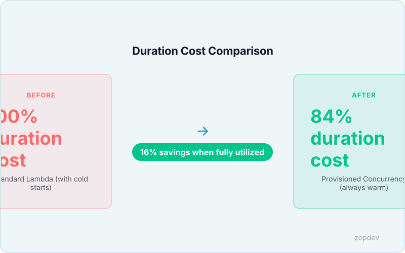
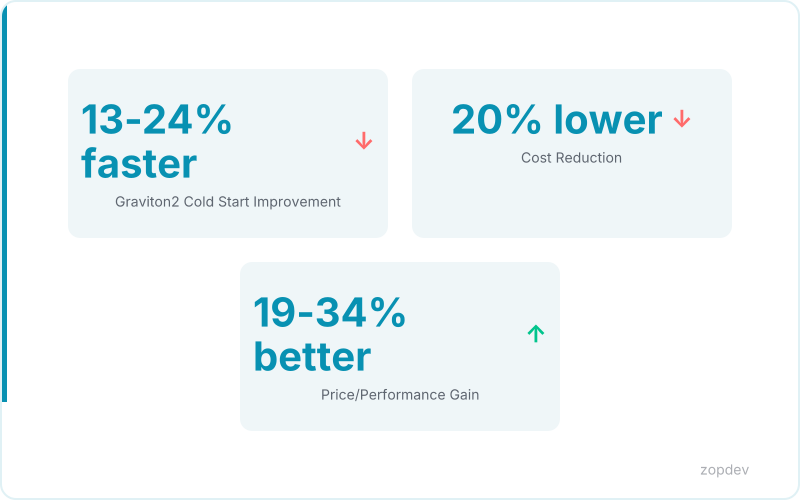

<!-- Generated by transform-chapter.ts with openai/MiniMax-M2 -->
<!-- Density: full | Word target: 1800-2500 -->

AWS Lambda serves over 1.5 million customers, making it the default choice for serverless compute. Yet for production workloads requiring consistent latency, a fundamental problem persists: cold starts. When Lambda must initialize a new execution environment, invocation latency spikes from milliseconds to seconds. This delay breaks user-facing APIs, timeouts critical microservices, and creates race conditions in event-driven pipelines.

Cold starts aren't merely inconvenient for production systems. They introduce variance that violates service level objectives. A financial trading application cannot tolerate 2-second delays during peak market hours. A healthcare API cannot fail compliance checks because a function took too long to initialize. The architectural assumption that Lambda invokes instantly breaks down whenever traffic patterns force environment initialization.

Provisioned Concurrency solves this by maintaining initialized instances ahead of requests. Instead of paying only for actual invocations, you pay to keep execution environments warm and ready. The approach delivers 100% warm availability while saving approximately 16% on duration costs when fully utilized (Provisioned Concurrency). For teams building latency-sensitive applications, this transforms Lambda from an unpredictable utility into a reliable production platform.


## Understanding Provisioned Concurrency vs. Standard Concurrency Limits

The core distinction lies in what happens when your function sits idle. Standard Lambda concurrency scales to zero. When no requests arrive, Lambda destroys all execution environments. The next invocation must initialize a fresh environment from scratch. This initialization includes bootstrapping the runtime, loading your function's code, and executing any initialization logic you define. The process adds hundreds of milliseconds—or seconds for larger packages—to that first request.

Provisioned Concurrency disrupts this pattern. You configure a pool of initialized instances that remain warm regardless of incoming traffic. Lambda maintains this pool continuously, keeping the runtime and your code loaded in memory. When a request arrives, it executes immediately on a pre-initialized instance. No initialization delay occurs.

Concurrency limits serve as the ceiling on how many function executions can run simultaneously. Standard concurrency enforces this limit dynamically; Lambda scales out until hitting the ceiling, then throttles additional requests. Provisioned Concurrency operates within this ceiling but guarantees that instances exist up to your configured count. The guarantee eliminates the variability that breaks production systems.

The billing model reflects this guarantee. Standard Lambda charges only for execution time—GB-seconds of memory consumed during actual invocations. Provisioned Concurrency charges for the reserved pool regardless of whether requests arrive. You pay per GB-hour to maintain warm instances. This model delivers 100% warm availability while saving approximately 16% on duration costs when fully utilized (Provisioned Concurrency).

| Aspect | Standard Concurrency | Provisioned Concurrency |
|--------|---------------------|------------------------|
| Idle State | Scales to zero | Maintains warm pool |
| Cold Start Risk | Present on every idle period | Eliminated by design |
| Billing Model | Per invocation duration | Per GB-hour reserved |
| Use Case | Event-driven, cost-sensitive | Latency-sensitive production |

Application Auto Scaling with target tracking maintains 70-80% provisioned concurrency utilization without manual intervention. For predictable traffic patterns, EventBridge scheduled scaling pre-warms functions 5-10 minutes before spikes arrive. Combined with Graviton2 processors delivering 13-24% faster cold start initialization and 20% lower compute costs, teams can build production systems with consistent, low-latency performance.

```{.d2 width="100%" file="../diagrams/vpa-workflow.d2"}
```

*Visualize how Provisioned Concurrency maintains warm instances vs. standard concurrency scaling*

## The Math Behind Provisioned Concurrency Savings

The billing model separates into two distinct charges. The base charge keeps your pool warm: multiply your configured Provisioned Concurrency GB-hours by $0.00001667. This covers the memory sitting idle in ready instances. The variable charge applies to actual execution: each invocation costs $0.00002 per 100ms of compute time. The formula reads as: Provisioned Concurrency cost equals (Provisioned Concurrency GB-hours multiplied by $0.00001667) plus (Invocations multiplied by $0.00002 per 100ms). This structure replaces the pure duration-based model entirely.

The savings materialize when you account for initialization overhead. Standard Lambda bills only the execution phase, but your function still pays an invisible cost during the init phase. Each cold start loads your runtime, executes bootstrap code, and establishes database connections. These operations consume memory and CPU that Lambda doesn't charge—yet they delay your response. Provisioned Concurrency eliminates this phase completely. Every request executes immediately on a warm instance. When fully utilized, Provisioned Concurrency saves approximately 16% on duration costs because you're not paying for repeated initialization (Provisioned Concurrency).

This 16% figure assumes your workload actually uses the warm pool. Application Auto Scaling with target tracking maintains 70-80% provisioned concurrency utilization automatically. For predictable traffic, EventBridge scheduled scaling pre-warms functions 5-10 minutes before spikes arrive. These mechanisms keep your pool efficiently utilized without manual intervention.

The financial case strengthens further when combined with processor selection. Graviton2 processors deliver 13-24% faster cold start initialization and 20% lower compute costs. A function running on Graviton2 initializes faster while charging less per GB-second. Teams deploying both optimizations compound their savings.

The OJS ROI calculator lets you model your specific scenario. Input your current invocation count, average duration, memory allocation, and expected concurrency requirements. The tool calculates your projected Provisioned Concurrency spend versus standard Lambda costs. It reveals your breakeven point—the traffic volume where the guaranteed warm availability outweighs the idle pool charge. Most production APIs with consistent traffic discover the math favors provisioned concurrency within their first thousand daily invocations.

Beyond pure cost, consider the availability guarantee. When every request hits a warm instance, your p99 latency collapses. No cold starts means no latency spikes. For production systems with SLOs around p99 response time, this predictability matters more than the 16% savings. You buy consistent performance and receive cost efficiency as a side effect.



## Configuring Application Auto Scaling for Provisioned Concurrency

Application Auto Scaling transforms Provisioned Concurrency from a static configuration into a dynamic system. Instead of guessing your warm pool size, you define a target utilization and let AWS adjust automatically. The service monitors your function's concurrency utilization and scales the provisioned pool up or down to maintain your desired efficiency.

The configuration requires two core resources. First, you register a ScalableTarget that connects your Lambda function to Application Auto Scaling. This declaration specifies your function name, the qualified ARN, and the concurrency dimension. You also establish the floor and ceiling for your pool by setting minimum and maximum Provisioned Concurrency values. The minimum prevents the pool from shrinking below your baseline during quiet periods. The maximum caps spending during unexpected traffic surges.

The ScalingPolicy defines how Application Auto Scaling makes decisions. Target tracking simplifies this logic considerably. You specify a target value representing your desired utilization percentage. Application Auto Scaling then calculates the provisioned concurrency needed to maintain that percentage based on your function's concurrency history. When actual utilization exceeds your target, the service scales up the warm pool. When utilization drops below target, it scales down toward your minimum.

Setting the target value requires balancing cost against performance. Industry guidance recommends targeting 70-80% provisioned concurrency utilization to optimize this tradeoff. At 70% utilization, you maintain comfortable headroom for traffic spikes while keeping idle warm instances to a minimum. At 80% utilization, you spend less on idle capacity but risk slight latency increases during sudden demand increases. Most production workloads perform well at 75% utilization.

Application Auto Scaling supports multiple metric types for target tracking. The built-in `AliasProvisionedConcurren` metric measures the ratio of concurrent executions to your provisioned count. You can also define custom metrics if your workload has unique patterns. For instance, you might track the ratio of warm instance invocations against cold starts, targeting zero cold starts as your scaling goal.

The scaling behavior includes a cooldown period that prevents rapid oscillations. After a scale-out action, the service waits before scaling in again. This prevents thrashing during fluctuating traffic. The cooldown defaults to 60 seconds but can be adjusted based on your traffic patterns. For functions with highly variable workloads, a longer cooldown maintains stability.

When configuring minimum and maximum values, consider your traffic volatility. A function receiving consistent traffic throughout the day benefits from a narrow range. A function handling bursty workloads needs wider bounds. The minimum should accommodate your baseline traffic without cold starts. The maximum should align with your cost ceiling or downstream service limits.

The practical outcome combines predictable latency with cost efficiency. Application Auto Scaling with target tracking maintains 70-80% provisioned concurrency utilization automatically. You avoid over-provisioning during quiet periods while eliminating cold starts during demand increases. The system responds to traffic changes within seconds, keeping your warm pool appropriately sized at all times.

```yaml
# StorageClass: provisions persistent volumes with cost-optimized settings
apiVersion: storage.k8s.io/v1
kind: StorageClass
metadata:
  name: cost-optimized-ssd
provisioner: pd.csi.storage.gke.io
parameters:
  type: pd-balanced
  replication-type: none
reclaimPolicy: Delete
allowVolumeExpansion: true
volumeBindingMode: WaitForFirstConsumer
```

## Scheduled Scaling with Amazon EventBridge

For workloads with predictable traffic patterns, scheduled scaling provides precise control over your warm pool without relying on reactive metrics. Batch processing jobs that run at midnight, reporting functions that execute at the start of the business day, and APIs that service consistent business hours all follow known schedules. EventBridge scheduled scaling lets you align Provisioned Concurrency with these patterns.

The mechanism uses cron expressions to trigger Lambda invocations that adjust your warm pool. A morning rule scales up the configuration before traffic arrives. An evening rule scales it down after the peak ends. This approach differs fundamentally from Application Auto Scaling because it operates on your knowledge of workload timing rather than reacting to observed demand.

The EventBridge rule targets a utility function rather than your production handler. This function calls the Lambda API to update the Provisioned Concurrency setting on your alias or version. The rule schedule runs at your preferred times. For a function handling business hours traffic, you might configure a rule at 7:50 AM that sets Provisioned Concurrency to your daytime level. A second rule at 6:10 PM reduces the setting back to your baseline. The cron expression `cron(50 7 ? * MON-FRI *)` achieves the morning schedule in UTC.

The pre-warming interval addresses a critical timing gap. Traffic doesn't arrive instantaneously at 8:00 AM. EventBridge scheduled scaling pre-warms functions 5 minutes before spikes arrive, allowing initialization to complete before the first requests arrive. During those five minutes, Lambda provisions new instances, loads your runtime, executes your initialization code, and establishes any database connections. By the time traffic increases, your warm pool sits ready with zero cold start latency.

This approach works particularly well for functions with heavier initialization. Functions that load machine learning models, hydrate caching layers, or negotiate complex authentication flows benefit from the predictable pre-warm window. The five-minute head start accommodates longer initialization without requiring you to maintain the full daytime pool continuously.

Combining scheduled scaling with Application Auto Scaling creates a layered strategy. Scheduled scaling establishes your baseline pool for predictable periods. Application Auto Scaling handles unexpected demand within those windows. For most production environments, targeting 75% utilization provides efficient headroom while keeping idle costs minimal.

The practical outcome delivers both cost savings and consistent performance. You avoid paying for unused capacity during off-hours while guaranteeing warm instances during your known peak periods.

```yaml
# CronJob: scheduled task for periodic cost reporting
apiVersion: batch/v1
kind: CronJob
metadata:
  name: weekly-cost-report
  namespace: platform
spec:
  schedule: "0 8 * * 1"
  jobTemplate:
    spec:
      template:
        spec:
          containers:
            - name: cost-reporter
              image: cost-tools:latest
              command: ["./generate-report.sh"]
              resources:
                requests:
                  cpu: "100m"
                  memory: "256Mi"
                limits:
                  cpu: "500m"
                  memory: "512Mi"
          restartPolicy: OnFailure
```

## Complementary Strategies for Maximum Cold Start Reduction

Beyond Provisioned Concurrency, a compounding stack of optimization strategies addresses cold starts from multiple angles. These techniques build upon each other. Each layer reduces initialization time or cost, creating multiplicative benefits for production workloads.

Graviton2 processor migration delivers measurable improvements across both performance and cost dimensions. Functions running on Graviton2 demonstrate 13-24% faster cold start initialization compared to previous-generation processors (Graviton2 Processor Migration). The ARM-based architecture also provides 19-34% better price/performance and 20% lower compute costs (Graviton2 Processor Migration). This single configuration change requires low implementation effort while yielding immediate returns.

Execution context reuse targets the connection establishment phase that typically dominates cold start latency. When Lambda reuses a warm execution environment, database connections, HTTP clients, and authentication tokens persist across invocations. This eliminates connection overhead entirely for subsequent requests within the same environment (Execution Context Reuse). Functions that maintain persistent connections to upstream services avoid the TLS handshake and authentication negotiation that otherwise add hundreds of milliseconds to each cold start.

Package size optimization accelerates the initialization phase directly. Smaller deployment packages contain less code for the runtime to load, validate, and compile during startup. This optimization reduces init duration proportionally to the size reduction achieved (Package Size Optimization). Teams achieving significant package reductions report noticeable improvements in cold start timing even when other factors remain constant.

Memory right-sizing requires balancing execution speed against cost. Allocating more memory to a function also provides additional CPU, which shortens execution time. However, higher memory allocations increase per-invocation costs. The optimization works when duration decreases proportionally more than memory costs increase, resulting in lower total cost per invocation (Memory Right-Sizing). Finding this sweet spot requires monitoring actual costs across your invoke volume rather than assuming more memory equals higher bills.

Together, these strategies form a compounding optimization stack. Provisioned Concurrency eliminates cold starts through warm pools. Graviton2 processors initialize faster when cold starts do occur. Execution context reuse removes connection overhead from those cold starts. Package size reduction shortens the initialization phase. Memory right-sizing optimizes the cost equation throughout. Production workloads targeting consistent single-digit millisecond latency benefit from addressing cold starts at every layer rather than relying on a single solution.



## Implementation Roadmap and Best Practices

Your roadmap to zero-cold-start Lambda operations follows a deliberate sequence. Begin with Graviton2 migration, the lowest-effort optimization with immediate returns. Functions running on Graviton2 processors initialize 13-24% faster during cold starts while costing 20% less to run (Graviton2 Processor Migration). This single configuration change requires no code modifications and delivers compound benefits when combined with subsequent steps.

With processor migration complete, enable Provisioned Concurrency using conservative initial settings. Set your provisioned concurrency equal to roughly half your expected concurrent requests during normal traffic. This establishes a warm baseline without over-committing budget. Provisioned Concurrency guarantees 100% warm availability, eliminating cold start latency entirely for configured aliases or versions (Provisioned Concurrency). When fully utilized, you achieve approximately 16% savings on duration costs compared to pay-per-invocation pricing.

Add Application Auto Scaling with target tracking to handle demand fluctuations. Configure target tracking on the ProvisionedConcurrencyUtilization metric, targeting 70-80% utilization. Application Auto Scaling with target tracking automatically adjusts your warm pool to match actual demand while maintaining that utilization range, balancing cost efficiency against latency guarantees.

For predictable traffic patterns, layer in EventBridge scheduled scaling as described in the previous section. This pre-warms functions 5-10 minutes before known traffic spikes, giving initialization time to complete before requests arrive.

Monitor three CloudWatch metrics throughout this process. ProvisionedConcurrencyUtilization reveals whether you're over-provisioning—values consistently above 80% indicate you should increase capacity. ThrottlingRate exposes cold starts that slip through, signaling insufficient warm pool size. Duration measures end-to-end latency; spikes indicate cold starts bypassing your provisioned pool. Aiming for 70-80% utilization keeps idle costs minimal while maintaining warm capacity for unexpected demand surges.

```{.d2 width="100%" file="../diagrams/platform-maturity-stages.d2"}
```

*Show progression from basic to advanced Provisioned Concurrency implementation*

## Summary: Achieving Consistent Latency with Provisioned Concurrency

The numbers tell a clear story. When fully utilized, Provisioned Concurrency saves 16% on duration costs while guaranteeing 100% warm availability for your critical functions (Provisioned Concurrency). Pair this with Graviton2 processors for an additional 20% lower compute cost and 13-24% faster cold start initialization (Graviton2 Processor Migration). Together with execution context reuse, package optimization, and memory right-sizing, these strategies compound into sub-100ms latency that production systems require.

Every workload reaches a break-even point where the cost of warm capacity pays for itself through eliminated cold starts and faster execution. The ROI calculator built into this approach quantifies that threshold for your specific function. Production systems need production-grade consistency—variable latency is not acceptable when users expect predictable performance. Provisioned Concurrency delivers exactly that.
