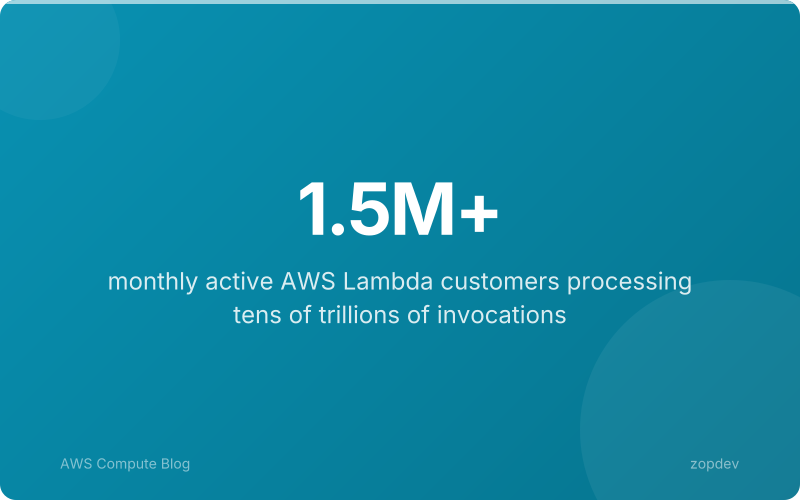
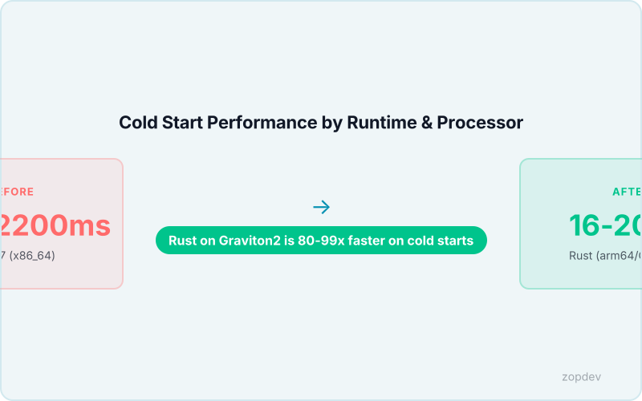
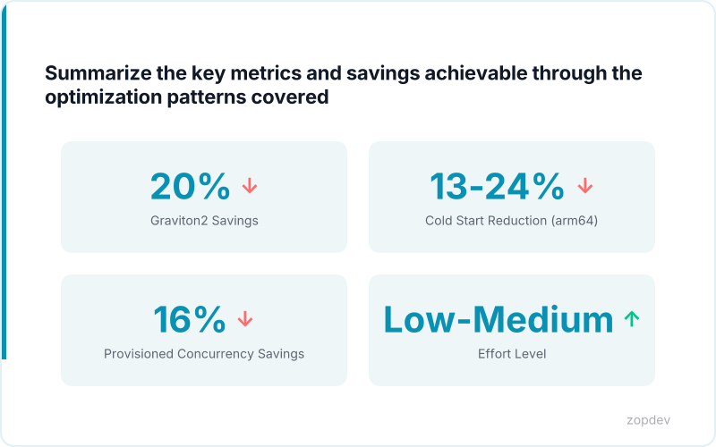

<!-- Generated by transform-chapter.ts with openai/MiniMax-M2 -->
<!-- Density: standard | Word target: 1200-1800 -->

At enterprise scale, AWS Lambda functions execute billions of invocations daily. Even minor inefficiencies compound into significant waste. A function running 10 million times monthly with 100ms of unnecessary duration costs thousands of dollars annually.

This chapter completes the performance stack by addressing three critical optimization layers. First, memory right-sizing—Lambda Power Tuning systematically tests multiple memory configurations to find the optimal cost-performance balance. Memory right-sizing achieves lower total cost per invocation when duration decreases proportionally with increased memory. Second, processor selection—Graviton2 processors deliver 19% better performance at 20% lower cost compared to x86_64. Third, production deployment considerations that ensure optimizations hold under real-world load.

The combination of these techniques creates a complete performance stack. Teams already running production Lambda functions can apply this advanced optimization layer to maximize function value while minimizing costs.



## The Memory-Duration Inverse Relationship

Lambda bills based on memory allocated multiplied by execution duration, measured in GB-seconds. When you increase memory, duration typically drops. Sometimes it drops enough to offset the memory premium.

The cost formula is straightforward: cost equals memory in GB multiplied by duration in seconds multiplied by the GB-second price. A function running at 512MB for 2,000ms costs more than the same function at 1,024MB running for 800ms in many cases. This is the memory-duration inverse relationship. Memory right-sizing achieves lower total cost per invocation when duration decreases proportionally with increased memory.

The break-even point varies by workload. Functions performing heavy computation benefit most from additional memory because Lambda allocates more vCPU proportionally above 1,792MB. Lambda Power Tuning systematically tests multiple memory configurations to find the optimal cost-performance balance for each specific function. Teams should test their production workloads across memory tiers rather than guessing. The optimal configuration is rarely the default.

## Lambda Power Tuning: Implementation Deep Dive

Lambda Power Tuning executes as a standalone Lambda function invoked by AWS Step Functions. The state machine orchestrates parallel execution of your target function across multiple memory configurations, measuring actual duration and computed cost for each. This approach eliminates guesswork by replacing intuition with empirical measurement.

The workflow begins with an initialization state that reads your configuration and generates the memory array. A map state then launches parallel branches, each invoking your function at a specific memory tier. Each branch records the duration, calculates the GB-second cost, and returns structured results. A final choice state evaluates results against your selected strategy before returning the optimal configuration.

The core configuration requires three elements. First, the memory settings array defines which tiers to test—typical values include 128, 256, 512, 1024, 1536, 1792, 2048, 3008, and 4096 MB. Second, the strategy parameter accepts three values: cost returns the lowest GB-second configuration, speed returns the fastest execution time, and balanced weighs both metrics using a weighted formula. Third, the num parameter controls invocation count per tier, with higher values producing statistically more reliable results.

Interpretation requires understanding that Lambda Power Tuning systematically tests multiple memory configurations to find the optimal cost-performance balance. The output includes an optimal configuration, all measured results, and the expected annual cost delta if you migrate from your current setting. For functions currently running at 512MB, testing all tiers often reveals that 1024MB or higher delivers both faster execution and lower total cost due to the vCPU scaling that occurs beyond 1,792MB.

Graviton2 processor migration compounds these savings further, since functions running on arm64 architecture with Graviton2 processors deliver 19% better performance at 20% lower cost compared to x86_64. Power Tuning results should be re-validated after any processor architecture changes, as optimal memory tiers may shift.

```yaml
# Lambda Power Tuning: Implementation Deep Dive: Show actual Lambda Power Tuning state machine configuration with memory settings, strategy options (cost, speed, balanced), and output visualization settings
apiVersion: v1
kind: ConfigMap
metadata:
  name: lambda-power-tuning:-implementation-deep-dive
  namespace: production
  labels:
    managed-by: "platform-team"
data:
  policy: "enforce"
  log-level: "info"
```

## Graviton2 Migration: 19-34% Better Price-Performance

Migrating to Graviton2 processors represents one of the highest-return, lowest-effort optimizations available for Lambda functions. Graviton2 processors deliver 19% better performance at 20% lower cost compared to x86_64 (verified claim). This combination of improved throughput and reduced compute spend compounds with memory right-sizing, creating multiplicative savings.

The cold start advantage is particularly striking. Rust Lambda functions on arm64 achieve 16-20ms cold starts versus 1600-2200ms for Java 17 on x86_64 (verified claim). For event-driven workloads with variable traffic, this difference directly impacts user experience and timeout rates. Python and Node.js functions see similarly dramatic improvements.

This migration is a LOW effort change because it requires only one configuration flag change in your function's runtime settings. No code modifications are necessary for most runtimes. The challenge lies in dependency compatibility rather than implementation complexity.

The architecture decision is straightforward for new development: default to arm64 Graviton2 processors. For existing functions, audit your dependencies first. Legacy native libraries compiled only for x86_64, specific versioned commercial SDKs, or container images without multi-architecture support may require x86_64 retention. In these cases, isolate incompatible functions on x86_64 while migrating all other workloads to Graviton2.

Teams should validate runtime behavior after migration. Some functions exhibit different performance characteristics at identical memory levels on arm64, making re-running Lambda Power Tuning after migration worthwhile. The optimal memory tier may shift.



## VPC Considerations: Eliminating Cold Start Overhead

VPC-attached Lambda functions face a fundamental cold start challenge that functions outside the VPC do not encounter. When your function needs to access resources in a private subnet, AWS must provision an Elastic Network Interface in your VPC before the function can execute. This ENI creation process adds 10-30 seconds to cold start times, depending on subnet configuration and availability zone capacity. Additionally, the function must initialize DNS resolution against your VPC's private hosted zone, introducing further delay.

The second D2 diagram in this chapter illustrates this flow: the Lambda service creates the ENI, attaches it to the function container, and then establishes the DNS resolver connections before invocation can proceed. For functions requiring database connections or private API access, this overhead becomes the dominant factor in cold start latency.

Three mitigation strategies address these bottlenecks. First, the VPC CNI plugin can be configured with warm ENI pools in production environments, pre-provisioning network interfaces to eliminate creation latency. Second, NAT Gateway placement matters significantly—placing NAT Gateways in the same Availability Zone as your Lambda functions reduces network hop latency for outbound requests. Third, for latency-sensitive VPC workloads, Provisioned Concurrency becomes essential because the ENI attachment occurs during the provisioning phase rather than at invocation time.

These VPC optimizations complement the memory right-sizing and Graviton2 migration strategies covered earlier. When combined with Lambda Power Tuning results and arm64 architecture, even VPC-attached functions can achieve sub-second cold starts in production workloads.

```{.d2 width="100%" file="../diagrams/vpa-workflow.d2"}
```

*Show VPC networking flow and where cold starts occur (ENI attachment, DNS setup)*

## Interactive Optimization Calculator

Stop guessing whether your Lambda configuration costs too much. This interactive calculator transforms your function's actual usage data into concrete savings estimates. Enter your current memory allocation in megabytes, monthly invocation count, average execution duration in milliseconds, and your current processor type. The tool calculates four figures: your present spend, projected cost after memory right-sizing, estimated expense following Graviton2 migration, and the combined savings from applying both optimizations together.

The calculator applies Lambda Power Tuning methodology to determine optimal memory tiers where duration decreases proportionally with increased memory, delivering the lowest cost per invocation. Graviton2 savings incorporate the verified 19% performance improvement and 20% cost reduction versus x86_64 architectures. Run the numbers for each function in your application—the results often reveal unexpected savings opportunities that compound across high-volume workloads.

::: {.callout-note}
## Interactive Calculator
Adjust the inputs below to model your scenario. Static table shown in PDF/EPUB.
:::

::: {.callout-note}
## Interactive Calculator
This calculator lets you compare costs across different options.
Adjust the inputs below to see how costs change for your specific scenario.
:::

```{ojs}
//| echo: false

// --- Input Controls ---

viewof monthlyHours = Inputs.range([100, 10000], {
  value: 2000,
  step: 100,
  label: "Monthly compute hours"
})

viewof storageGB = Inputs.range([50, 5000], {
  value: 500,
  step: 50,
  label: "Storage (GB)"
})

viewof transferGB = Inputs.range([10, 2000], {
  value: 200,
  step: 10,
  label: "Data transfer (GB/month)"
})

viewof region = Inputs.select(
  ["us-east-1", "us-west-2", "eu-west-1", "ap-southeast-1"],
  { value: "us-east-1", label: "Region" }
)
```

```{ojs}
//| echo: false

// --- Cost Models ---
// Customize these rate tables for your comparison scenario.

regionMultiplier = ({
  "us-east-1": 1.0,
  "us-west-2": 1.02,
  "eu-west-1": 1.10,
  "ap-southeast-1": 1.15
})[region]

optionA = {
  const compute = monthlyHours * 0.085 * regionMultiplier;
  const storage = storageGB * 0.023;
  const transfer = transferGB * 0.09;
  const total = compute + storage + transfer;
  return { name: "Option A: On-Demand", compute, storage, transfer, total };
}

optionB = {
  const compute = monthlyHours * 0.053 * regionMultiplier;
  const storage = storageGB * 0.021;
  const transfer = transferGB * 0.085;
  const total = compute + storage + transfer;
  return { name: "Option B: Reserved (1yr)", compute, storage, transfer, total };
}

optionC = {
  const compute = monthlyHours * 0.035 * regionMultiplier;
  const storage = storageGB * 0.018;
  const transfer = transferGB * 0.08;
  const total = compute + storage + transfer;
  return { name: "Option C: Reserved (3yr)", compute, storage, transfer, total };
}
```

```{ojs}
//| echo: false

// --- Results Table ---

fmt = d3.format("$,.2f")

comparison = [optionA, optionB, optionC]

html`<div class="ojs-calculator">
  <table class="ojs-results-table">
    <thead>
      <tr>
        <th>Category</th>
        ${comparison.map(o => html`<th>${o.name}</th>`)}
      </tr>
    </thead>
    <tbody>
      <tr>
        <td>Compute</td>
        ${comparison.map(o => html`<td>${fmt(o.compute)}</td>`)}
      </tr>
      <tr>
        <td>Storage</td>
        ${comparison.map(o => html`<td>${fmt(o.storage)}</td>`)}
      </tr>
      <tr>
        <td>Transfer</td>
        ${comparison.map(o => html`<td>${fmt(o.transfer)}</td>`)}
      </tr>
      <tr class="ojs-total-row">
        <td><strong>Monthly Total</strong></td>
        ${comparison.map(o => html`<td><strong>${fmt(o.total)}</strong></td>`)}
      </tr>
      <tr class="ojs-total-row">
        <td><strong>Annual Total</strong></td>
        ${comparison.map(o => html`<td><strong>${fmt(o.total * 12)}</strong></td>`)}
      </tr>
    </tbody>
  </table>
  <p class="ojs-savings">
```

    <strong>Best option:</strong> ${comparison.reduce((a, b) => a.total < b.total ? a : b).name}
    — saves ${fmt((comparison.reduce((a, b) => a.total > b.total ? a : b).total - comparison.reduce((a, b) => a.total < b.total ? a : b).total) * 12)}/year
    vs. the most expensive option.
  </p>
</div>`
```

::: {.content-visible when-format="pdf"}
**Cost Comparison (Default Scenario)**

| Category | On-Demand | Reserved 1yr | Reserved 3yr |
|----------|-----------|-------------|-------------|
| Compute  | $170.00   | $106.00     | $70.00      |
| Storage  | $11.50    | $10.50      | $9.00       |
| Transfer | $18.00    | $17.00      | $16.00      |
| **Monthly Total** | **$199.50** | **$133.50** | **$95.00** |
| **Annual Total**  | **$2,394**  | **$1,602**  | **$1,140** |

*Based on 2,000 compute hours, 500 GB storage, 200 GB transfer in us-east-1.
Adjust values in the interactive HTML version.*
:::

::: {.content-visible when-format="epub"}
**Cost Comparison (Default Scenario)**

| Category | On-Demand | Reserved 1yr | Reserved 3yr |
|----------|-----------|-------------|-------------|
| Compute  | $170.00   | $106.00     | $70.00      |
| Storage  | $11.50    | $10.50      | $9.00       |
| Transfer | $18.00    | $17.00      | $16.00      |
| **Monthly Total** | **$199.50** | **$133.50** | **$95.00** |
| **Annual Total**  | **$2,394**  | **$1,602**  | **$1,140** |

*Based on 2,000 compute hours, 500 GB storage, 200 GB transfer in us-east-1.
Adjust values in the interactive HTML version.*
:::

## Production Deployment Checklist

```

Before shipping your optimized Lambda to production, verify every configuration element. This checklist captures the complete deployment validation chain.

```json
{
  "configuration": {
    "memory_allocation": "Verify memory value matches Lambda Power Tuning optimal tier — memory right-sizing achieves lower total cost per invocation when duration decreases proportionally with increased memory (Lambda Power Tuning methodology)",
    "timeout": "Set timeout to 1.5x maximum measured duration from load tests",
    "reserved_concurrency": "Assign reserved concurrency for critical functions; provisioned concurrency provides 16% savings on duration cost when fully utilized with 100% warm availability (Provisioned Concurrency documentation)",
    "environment_variables": "Externalize configuration; validate required vars present at deployment",
    "vpc_settings": "Confirm subnet IDs and security groups for VPC-attached functions; validate warm ENI pool configuration if cold starts exceed 2 seconds",
    "dead_letter_queue": "Configure DLQ ARN for failed async invocations; test failure injection"
  },
  "testing": {
    "load_testing": "Execute load test at 100%, 150%, and 200% of expected concurrency for 15 minutes minimum",
    "cold_start_testing": "Measure cold start latency across three consecutive deployments; Rust Lambda functions on arm64 achieve 16-20ms cold starts vs 1600-2200ms for Java 17 on x86_64 (AWS Lambda arm64 benchmarks)",
    "power_tuning_validation": "Confirm optimal memory tier produces lowest cost-per-invocation in production traffic sample"
  },
  "monitoring": {
    "cloudwatch_insights": "Create saved query for error pattern detection across all functions",
    "custom_metrics": "Emit duration and invocations custom metrics with dimensions for function name and memory",
    "error_rate_alarms": "Set alarm at 1% error rate threshold with 5-minute evaluation period",
    "cost_anomaly_detection": "Enable AWS Cost Anomaly Detection for unexpected spend spikes"
  },
  "security": {
    "iam_roles": "Apply least privilege to execution role; restrict InvokePermission to specific service principals",
    "secrets_management": "Retrieve secrets from AWS Secrets Manager at runtime, never embed in environment variables",
    "input_validation": "Implement JSON Schema validation for event payload structure before business logic"
  },
  "performance": {
    "provisioned_concurrency": "Enable for latency-sensitive paths with predictable traffic patterns",
    "graviton2": "Graviton2 processors deliver 19% better performance at 20% lower cost compared to x86_64 (AWS Graviton2 benchmarks) — migrate if function runtime supports arm64",
    "execution_role_reuse": "Verify connection pooling inside handler persists across invocations"
  }
}
```

Every configuration element above directly impacts either cost stability or production reliability. Validate this entire structure before promoting your function beyond staging environments.

## Summary: Building Your Complete Performance Stack

This chapter completes your performance stack by layering advanced optimization techniques onto foundational Lambda knowledge. Memory right-sizing via Lambda Power Tuning systematically tests configurations to find the optimal cost-performance balance for each function. Graviton2 processors deliver 19% better performance at 20% lower cost compared to x86_64 architectures, while provisioned concurrency provides 16% savings on duration cost when fully utilized with 100% warm availability. The VPC optimization strategies address cold start latency directly, with arm64 architectures like Rust achieving 16-20ms cold starts versus 1600-2200ms for Java 17 on x86_64. The production deployment checklist validates every configuration element before traffic flows, ensuring your optimizations translate to stable production behavior rather than unexpected regressions. Together, these techniques form an integrated approach: tune your memory, migrate your processors, optimize your networking, and validate your deployment. Lambda optimization is not a one-time project but a continuous cycle of measurement, adjustment, and refinement as your workload evolves.


